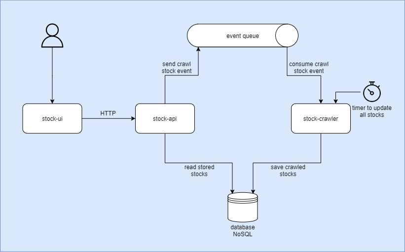

# Stocks Project

This is a project used to retrieve stocks information, from a third party website through crawling.

It is split into small services, each one with some purpose.

## Architecture


## Up and Running

This will start all services, then access the UI on <http://localhost:8080>

```bash
# infrastructure
docker-compose up -d --build mongo rabbitmq

# services
docker-compose up -d --build stock-crawler stock-api stock-ui
```
