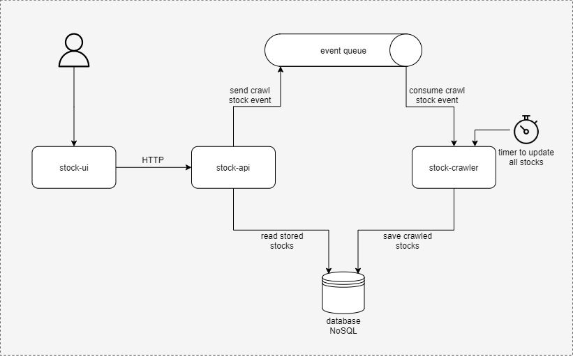
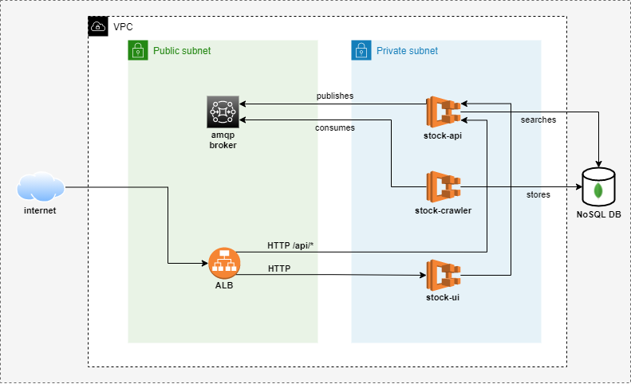

# Stocks Project

This is a project used to retrieve stocks information, from a third party website called statusinvest <https://statusinvest.com.br>, through crawling.

It is possible to search by american and brazilian stocks, and the default currency used will be US$.

It is split into small services, each one with some purpose.

## Application architecture


## Up and Running

### Locally

This will start all services locally, then access the UI on <http://localhost:8080>

```bash
# infrastructure
docker-compose up -d --build mongo rabbitmq

# services
docker-compose up -d --build stock-crawler stock-api stock-ui
```

### Cloud

> Some notes:

For the MongoDB we are going to use Cloud MongoDB <https://cloud.mongodb.com/>, then it will not be provisioned here, we will just pass the URI connection string as environment variable to the services.
The RabbitMQ will be the AWS MQ with interface for RabbitMQ.

## Cloud architecture



Instructions for deploy here: [Instructions](./infrastructure/README.md)
